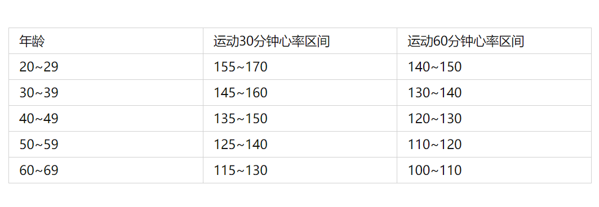

[TOC]

# 1 终点：三个维度——体重、体脂和体型

体重：亚洲男性BMI 18.5~24。**我自己现在BMI=26.7**

体脂：男性 15%~18%，年龄大可放宽

体型：中国男性的腰围应该小于85cm，腰臀比小于0.9

# 2 能量守恒：第一性原理——减肥打造能量缺口

1 增加能量消耗：只有运动和日常体力活动

2 长期减少能量摄入：**合理碳水、严控脂肪、补充蛋白**

# 3 铁证：减肥只有一条路——健康的生活方式

最有效的减肥方式——生活方式干预

健康生活方式的养成：饮食、运动和心理因素（压力和睡眠）—— 多管齐下

- 睡眠：节律和时长有关系
- 饮食：戒掉垃圾食品，时间久了，味觉神经和肠道菌群都会改变，之后下意识选择健康食品

形成自己健康的生活方式——自由而非固定的安排

# 【饮食】

## 4 能量缺口

### 调整饮食，打造能量缺口

吃进去 - 消耗的 = **-** 500~750 大卡 ， 理论上能减肥

> 500大卡大概是一包100g薯片的能量，1大卡 约= 4k焦
>
> 碳水和蛋白质都是1g 4大卡能量，脂肪最高1g 9大卡能量

### 身体不知道你需要多少能量

**真相1：饿只是身体感受，不代表身体需要。**

​	**——不用担心，按刚才的能量缺口吃就行了**

真相2：吃的能量低，不代表就要少吃、节食。

​	——选择能量密度低的食物，比如多吃富含纤维素的水果蔬菜，减肥餐也可以吃的很饱。

### 每日餐单：如何判断能量缺口大小

- 1 看标签：营养配料表，表示每100g的能量配比，也方便和其他100g进行比较
- 2 饮食拍照：把自己一天内吃的食物全部拍照，包括零食、酒水、饮料、有能量的都拍下来。
- 3 制定每日餐单：
  - 根据饮食拍照制造能量缺口，先减夜宵，再减含糖饮料，然后再减零食，还不行，减正餐。
  - 然后就这么吃，久而久之，能量缺口稳定，体重也就慢慢降下来了。
  - 餐单可以调整，等量蔬菜换蔬菜，其他一致。
- 4 后期检查
  - 按照500~750大卡的能量缺口，体重应该每周会稳定下降0.5kg~1kg
  - 如果没有瘦这么多，要么是能量减的不够，要么就是随着体重下降，你身体的消耗越来越小，能量缺口不存在了，即进入了减肥的平台期。这时候重复2和3步骤，再调整一次看看。

## 5 饮食选择

### 挑选事物的四个原则：学会挑食

- 1 食材越少加工越好

  - 简单烹饪就好

  - 非要烹饪：火锅（锅底别用牛油，调料别用麻酱）＞炒菜＞油煎＞油炸

  - 零食和饮料：大多是减肥的坑，如果配料表里成分很少，添加越少越好。

    > “真味是淡，至人如常”——《菜根谭》

  

- 2 事物越完整越好

  指的是各种蔬菜、水果和谷物——纤维素多，利于减肥；也保留大量微量元素和营养。

  

- 3 脂肪要选择**天然不饱和**

  - 不饱和脂肪酸占比越好，减肥越好。
  - 各种植物和海洋动物不饱和脂肪酸多，因为这些不需要储存脂肪抵御寒冷。除了橄榄球、棕榈油，几乎能榨油的植物都行，比如橄榄油、菜籽油、亚麻籽油、葵花籽油、玉米油都可以。
  - 坚果也可以，开心果、核桃、碧根果、松子、腰果、扁桃仁，都行，每天一捧。手掌丈量，别吃太多。
  - 鱼肉。首选深海鱼，每星期至少吃两次。
  - **特别注意**：千万不能选择反式脂肪酸，如果不是0
    - 1 黏附在血管上，导致心脑血管疾病发生的概率增加50%
    - 2 黏附在内脏脂肪上，增加腹部肥胖
    - 3 无论怎么运动和少吃，依然堆积在体内，很不容易代谢出来

  

- 4 蛋白质越纯越好

  - 蛋白质很抗饿，减肥时期多补充，每天每公斤至少补1g~1.5g。即，如果是60公斤，每天补充蛋白质能达到90g更好。
  - 一般有蛋白质，脂肪也少不了。怎么选？水里游＞天上飞＞地上跑＞不跑的。推荐：鱼肉、虾肉、鸽子肉、兔肉、鸡胸肉、鸭胸肉、驴肉、牛瘦肉、羊瘦肉、猪后腿肉和大排肉。
  - 当然，豆制品也行，即植物蛋白

### 一日三餐

1. 早饭必吃。科学发现，不吃早饭体重增加。
2. 晚饭不要超过9点。晚上8点刷牙，之后吃东西的冲动大大降低。

### 每餐的配比与选择

推荐四格餐盘：2-1-1

分别放置 蔬菜水果（2） 肉（1） 全谷物主食（1） 

不仅对减肥有效，对“三高”、心脑血管疾病、肿瘤也有预防作用。

## 6 效果评价：哪种饮食方案会一统江湖

推荐地中海饮食。最大特点就是均衡。

碳水化合物，包括主食、各种蔬菜、水果占据金字塔的底部，每天吃的最多；

往上一层是各种豆制品、奶制品，也每天都要吃；

再往上一层，量少一些，橄榄油、坚果，也每天都吃；

再往上鱼肉、虾肉、鸡肉、鸭肉，每周最少吃两到三次；

最上面是甜品、猪肉、牛羊肉，每周可以有一次。

其实：能量缺口是所有饮食方案能减肥的起点，而能坚持，则是减肥成功的终点。有时候，慢，反而成就另一种快。

当然也有许多方案，各有高低，但健康持续的生活是我现在追求的。所以适合自己的才是最好的。

# 【运动】

## 7 燃脂运动：什么项目减肥效率最高

运动能减肥，但必须搭配生活方式管理。

什么运动最燃脂？

1. 有氧。

2. 运动强度要合适

   > 年龄小于55岁且身体没什么疾病，有氧运动最佳心率 = （220 - 年龄 - 静息心率） × (0.6 ~ 0.75) + 静息心率
   >
   > 

3. 运动时间足够长

   即使是燃脂效率最高的中等强度的有氧运动，在前30min，消耗的60%也是肌肉里储存的糖。也就是说，想要燃烧脂肪，中等强度的有氧训练至少需要30min。虽然有HIIT，**目前科学减肥的权威指南推荐的最稳妥的方法，也不是HIIT，而是每周150min以上的中等强度的有氧运动。**

   能承受，可以考虑HIIT。

   **运动还要塑型，有氧运动+力量训练**

   

# 【心理因素】

## 8 心理能量：怎样才能避免中途放弃？

减肥时一定要管理好压力和睡眠，这是能帮我们坚持下去的能量场。心理因素就是我们的能量场。

### 管理压力

**影响**

- 响应压力，人体内皮质醇的含量会逐渐提高。
  - 皮质醇影响脂肪的分解。
  - 皮质醇影响人体的水平衡，让人变得水肿。
  - 阻断瘦素对大脑释放信号，进而降低代谢，影响减肥。
- 压力会改变我们的认知模式

**建议**

1. 转变思维。

   为自己制定一个短期的小目标。不用太难，时间周期也不要太长，完成了就给自己一个奖励。

2. 自我监测。

   1. **称重**。因为称体重是个非常好的心理暗示，每一次上秤都会在潜意识里引发你对体重的思考，会不自觉地校正自己的行为。
   2. **饮食拍照，备注想法**。
      1. 帮我分辨哪些情况可能导致自己做出不好的饮食选择。
      2. 帮我发现食物的隐患。比如，下午没忍住多吃了个冰激凌，这本身不好。之后翻看照片，看到自己忍不住吃了这些东西，下次就会很小心。

3. 主动舒缓宣泄，就是对压力打出的太极推手，四两拨千斤。可以尝试**瑜伽、冥想、正念等一些有呼吸导引的舒缓运动**，或者每天打上10~15min配合呼吸的太极，不仅帮你缓解压力，还能直接减肥。

### 睡觉

> **睡眠不足与BMI的增加**有关。与**每晚睡7-8小时的人相比**，睡5小时或更少的人，肥胖的几率更高，男性增加3.7倍，女性增加2.3倍。

1. 睡眠要在6~8小时之间。

   高质量的睡眠本身就消耗能量。一段6~8小时的睡眠，可以消耗400~500大卡的能量，相当于跑了10公里。

   > 请注意，是睡6-8小时。如果睡眠不足6小时，身体就会分泌刺激食欲的激素，让你口不停，一熬夜就加餐。但是超过8小时也不行，不仅睡眠消耗的能量不会再增加了，反而还会导致白天消耗的能量减少。所以最好控制在6-8小时，不要多也不要少。

2. 要有深度睡眠

   Why：

   ①瘦素的分泌会增加。瘦素增加，代谢增加。

   ②饥饿感减少，人自然就吃得少了。

   How:

   ①平时上班，不要压力那么大；

   ②白天争取出点汗，别总是坐着不动；身体累一点，大脑松一点。

   ③睡前4个小时千万别吃东西，水果也不行。

3. 睡眠要规律 

   也就是说，睡眠时间要相对固定，不能今天10点睡、明天2点睡、后天通宵白天睡。否则**人体夜间的激素分泌就会紊乱，包括指挥人体代谢的、分解脂防的、合成蛋白质的，全都会乱套。身体感受到压力和潜在的危险，会主动储存更多的能量，以备不时之需。**

   所以，熬夜不可怕，如果不得不熬夜，就尽量把它**熬规律**。比如今晚12点睡、明天8点起，那么明天也尽量保证这个固定时间，周未也不例外。

## 9 环境：为自己助力

社交圈没必要对抗，而是选择对应的社交圈。

1. 侵染，足够充分浸染。

   > 如果人们可以自由选择自己喜欢做的事情，他们通常会相互模仿。——埃里克·霍弗

2. 主动输出。

   自己的感受等等分享相互影响。

# 【医学干预】

## 10 药物：解盲，没有真正的减肥药

## 11 手术

1. 抽脂术几乎完全是为了局部塑型，是为了美丽而发明的，它既不能减肥，也不能让人收获健康。所以在医学上，抽脂术属于整形外科，也就是医疗美容的范畴。
2. 手术减肥一般不建议做，虽然目前没啥太大问题，但毕竟是手术。减肥手术不是一做就瘦，也要搭配生活方式。

## 12 轻断食：被大大低估的医学手段

> **医学上的轻断食，是一种医学饮食治疗，它不仅对断食的频率、断食的时间有要求，还对断食那天的能量摄入有严格的规定。**只有严格按照这套规定来，才算真正的轻断食。这一点，咱们是要先澄清的。

### WHY

1. 帮助减肥

2. 治疗疾病

   除了减肥之外，轻断食还可以治疗疾病。研究发现轻断食既可以控制血糖，逆转糖尿病前期，又能降低血压，还能减少哮喘、关节炎的急性发作。而且，除了身体层面的变化，轻断食居然还能提高记忆力，改善认知功能，对预防和治疗阿尔茨海默病、帕金森都有一定的作用。

3. 延年益寿

### WHAT

人体细胞感受到饥我的威胁后，就激发了节约能源保护自己的求生欲望。这种自我保护效应，又会激发心脏、肝脏、大脑、胃肠道等所有器官的潜力，提高表现，准备应对压力。
这还没完。在轻断食期间，为了适应环境改变的压力，我们身体的每一个细胞都会进行系统性修复，把自己的损伤修复好；而在轻断食结束、进入恢复期之后，正常的进食、良好的睡眠，又会把身体带入一个细胞生长、功能性组织重建的全新状态。这样往返交替，最终就达到了修复和新生的效果。

### HOW

#### 吃什么？

1. 水

2. 热量控制很低的范围内，500-700大卡内

   具体如何选择？—— 选择升糖指数低的食物，让自己饿的慢一些。详细见[附录1](# 1 GI，血糖生成指数Glycemic Index 简介)

   

   

   

3. 每公斤体重1g以上的蛋白质摄入

   蛋白质充足，人体免疫系统才能正常工作，人才不容易生病。可以选择**低脂牛奶、鸡蛋、瘦肉**这些食物作为蛋白质的来源。

4. 保证维生素和纤维素的补充

   把各种颜色的蔬菜、水果拼在一起吃。像**苹果、蓝莓、猕猴桃**这些热量低的水果都很不错，既补充了维生素，还补充了纤维素。更简单的，可以考虑来**一片复合维生素片**。

#### 何时吃？

**这500-700大卡的食物，要在6-8小时之内吃完**。

只有这样，才能保证我们的细胞充分感受饥我，启动修复和新生的程序。至于这8小时，是从早上8点到下午4点，还是中午11点到晚上7点，你都可以自由选择。

#### 频次吃？

比较经典的轻断食方案，只有两种一一

一种是轮替方案，也就是轮着来，今天轻断食，明天正常饮食，每周轻断食不超过3天。

另一种是“5+2"方案，一周当中任意两天轻断食，其余五天正常。可以是连续断两天，也可以是间隔断两天，都行，都有效。

### START

课程的最后，我给你一个具体的轻断食范例，这样你就好操作了。比如，一个6个月的轻断食减肥方案，就可以这样循序渐进：

第一个月，每周只有1天轻断食，这一天可以吃到1000大卡食物，从早8点到晚6点，10个小时内吃完。这个月不难吧？

第二个月，我们每周增加一天，2天轻断食，每天还是1000大卡，进食时间减少到8个小时。其他日子里正常吃。

第三个月，还是每周两天，每天减少到750大卡，进食时间缩减到6个小时。

第四个月，每周两天，每天再少吃一点，减少到500大卡，进食时间还是6个小时。

这样再维持两个月，我们就完成计划了。一拆解，发现就不是很难了。对不对？

这里还要叮嘱一下：在轻断食的初期，大多数人都会经历饥理感、烦躁和注意力下降。别担心，这些反应几乎会在1个月内完全消失，绝大部分人都可以继续。

## 13 医学减肥：顶级团队的体重管理秘笈

> 一些权威中心如何帮人减肥

### (1) 评估：判断减还是不减

当一个人来到我们减肥中心，我们要做的第一件事就是评估。评估什么呢？评估减还是不减。**先看需不需要减，再讨论如何减，这是原则问题**。

判断方法和咱们前面讲的差不多。前面说过，亚洲人正常的BMI应该在18.5-24之间，这就是我们判断一个人需不需要减巴的最重要指标。具体来说一一

- 如果这人的BMI小于18.5，我们不会给他任何减肥的机会，再减就是拿生命开玩笑。
- 如果这人的BMI在18.5-24之间，体脂率、体型也都符合第一讲说的标准，那也不需要减肥。当然，如果体型不合格，比如腰太粗、有小肚腩，这样既不好看，也不健康，那我们就会建议他减肥。
- 如果BMI大于24呢？按理说这就超重了，应该要减肥。不过在真正面对他们的时候，我们处理的标准会稍微宽松一点。如果这人还挺健康的，既没有“三高”，也没有糖尿病的风险，又没有睡眠呼吸暂停综合征、脂肪肝等肥胖导致的疾病，我们会建议他减肥，但不会要求他必须减。如果不想减，只要体重不
  再增加，也OK。如果这人正想着减肥，那当然更好。
- 如果这人有上面说的任何一种疾病，或者虽然没查出啥疾病，但BMI已经超过30了，那无论如何，我们都会强烈建议他接受减肥治疗。

### (2) 评估个人状况并制定目标

如果评估完确认对方要减肥，接下来怎么办呢？

我们要做的第二件事，依然是评估，评估这人的生活方式。这一步非常重要，不仅能帮我们找到对方肥胖的原因，还能找到他目前生活方式存在的问题。只有搞清楚了这两个问题，后续的治疗才能更精准。

举个例子。还是我的闺蜜小满，她来找我减肥时，我先让她详细回忆了自己的减肥历程和生活方式。

大学的时候，小满也是个校花，1米73的她，体重只有62kg左右。但7年前，小满不幸患上了**抑郁症**。从那之后，体重就一路狂飙，慢慢长到了78kg。之后她一直有减肥的念头，也间断着尝试过两次，有一次还请了健身教练，但效果都不大。

小满是个护士，每周要倒3次班。上夜班时的晚饭，基本都是快餐，在开车的路上就搞定了。也因为上班忙，除了带孩子之外，她几乎没什么运动。

一边听我一边做记录，到这里，我就把小满的减肥过程画成了一张表。表格的横坐标是时间，纵坐标是她的体重。你可以想象到表格里一条弯弯曲曲的体重曲线吗？**在每次她的体重发生剧烈变化的地方，我都会标注上当时她发生的大事、一日三餐的习惯、运动情况、情绪、睡眠、工作压力、吃过的药、得过的病等等，能多详细就多详细。**

这就是我和小满一起做的生活方式分析。也正是从这张图，小满第一次了解自己体重的历史，也了解了自己的每一次失败。

我们很快就在表里找到了一个特别的事件一一抑郁症。这是导致小满体重发生最大变化的一次，也是她后面所有的减肥尝试都难以维持的**原因**。至于她上夜班总吃快餐、缺乏运动这些**生活方式**问题，当然也是我们要解决的。

明确了这个问题以后，我就和小满定了一个小目标：6个月内，减掉她体重的10%，大约就是8kg。只要6个月内达到这个目标，就算减肥成功。

同学们可别嫌馒，这是无数医学家共同总结出来的结论——

**如果BMI小于等于35，最好6个月内减少现在体重的5%-10%；如果BMI超过35，可以6个月减少体重的10%-15%。6个月后，再设定下一轮计划。**

这么设定有三个好处：

- 第一，难度适中，努力能达到；
- 第二，健康，即使6个月后还没达到”三体目标”，也大大降低了患各种疾病的风险；
- 第三，不容易反弹。

我们很多减肥的优秀生，问题都出在了设定这个近期目标上。“欲速则不达”，往往减肥的成绩单还在路上，体重就反弹了。

可能你会觉得，反弹了再减呗？有啥大不了的？但其实，**体重的反弹循环对身体的伤害更大**。与其瘦了再胖，还不如一直胖着。

### (3) 确定方案和开展治疗

小满之前也并没接受过规范的减肥治疗，因此，我首先给她推荐的就是生活方式治疗，也就是前面说的生活方式调整。

当然，在我们减肥中心，比咱们自己在家专业多了，有一个多学科团队专门为小满服务。这其中，包括医生、临床营养师、运动体能师和心理治疗师。6个月，36次面对面的减肥课程，包括**饮食、运动和心理**三个方面。你看，正对着咱们生活方式管理的三个部分。具体来说——

在饮食方面，通过**氧代谢水平**，测定了她的基础代谢率。然后，追踪了小满的典型生活，前后三天，详细记录她入口的每一口食物、做的每一项运动。最后，再结合小满的饮食习惯、体脂目标，给她设计了一个专属的减肥餐单。

如果小满不会做饭呢？我们还会直接给她配好营养餐，或者帮她选择代餐。临床营养师每周至少和小满复盘一次，看看她这一周的饮食情况。如果需要，及时调整餐单。

在运动方面，我们让小满进行了一次运动心肺实验，找到了她**燃脂效率**最高的那个运动强度。然后，由运动体能师每周三到五次，陪着小满进行这个强度的有氧运动。为了达到**体型目标**，在有氧训练后还会有几组核心肌群的力量训练，重点锻炼她的**腰、腹、臀、大腿**这些部位。

在心理方面，这也是小满最大的问题，在进行了详细的心理评估后，我们给小满开了**抗抑郁药物**，并且请心理治疗师规律的陪她做了12次心理和正念治疗。

6个月后，小满的体重稳稳地减掉了8.5kg，目标达成。

但减肥治疗没有就此结束。我们依然会每个月和小满进行一次电话访谈，看看她对健康生活方式的坚持情况。现在一年半过去了，这个减肥成果还保持着。

你看，其实都是咱们前面讲的，只不过我们有专门的团队、有更精确的检测设备、有贴身的一对一服务。**正常来说，只要你按咱们前面讲的做，大概率就能成功。**

### (4) 减不下来以及怎么保持

如果6个月的生活方式干预没成功怎么办呢？

这时候，我们会考虑更加严格的行为干预，比如合并代餐、封闭式的训练营、特殊的医学饮食治疗等。如果这人BMI大于27，并且合并了一些和肥胖相关的疾病，比如高血压、高血脂、心脑血管疾病等，我们就可以考虑上奥利司他这样的减肥药；如果合并的是糖尿病呢？我们会考虑二甲双胍或者利拉鲁肽治疗。和二甲双肌类似，利拉鲁肽也是一种可以治疗糖尿病并且达到减肥效果的药物。如果这人的BMI大于30，虽然没有任何疾病，我们也可以推荐他开始药物治疗。

如果BMI大于35，并且合并严重的糖尿病，或者虽然没有其他疾病，但BMI已经大于40，我们就会推荐他考虑减肥手术。

当然，如果减下来了，也一定要抱着“革命尚未成功，我辈仍需努力“的心态，将这6个月的生活习惯坚持下来。很多研究表明，有个简单的维持方法一一至少每周上一次秤，就是对自己最好的激励。

这其中**推荐你尤其注意的是，运动需要保持在每周200分钟以上**，不是我们以前减肥时说的150分钟，它要更严格一些。

如果有条件，可以加入一年以上的长期减肥项目，至少每个月和专业人士联系一次。这些都会大大降低反弹的可能。

# 【其他讨论】

## 14 代餐：用好是神器

学了前面的课程我们知道，减肥的关键就是打造能量缺口。为了这个能量缺口，我们得花心思搭配每一顿饭，既要吃得有饱腹感，吃完不饿，还要保证吃进去的能量够低；既要保证营养丰富、吃得健康，还得味道可口、吃得美味…对于生活节奏很快的现代人来说，这确实太费事了。

商家们发现了这个需求痛点，就发开出了各种代餐产品。据说，代餐虽然总能量很低，但成分都是精心搭配的，不仅营养丰富，而且饱腹感强，吃完不饿。口味呢，更是多种多样，什么巧克力味、抹茶味都有，随便挑。更重要的，吃起来还非常方便。

### 代餐的神奇效果

直接告诉你答案吧。目前，全世界关于代餐的研究有好几千个，结论非常一致一一代餐真的能减肥，而且效果还很不错。具体怎么不错呢？

最简单的，当然是能减重。而且这个减重效果，还经得起时间的考验。

有一项名叫LOOK AHAED的代餐研究非常有名。研究者对5145名患者进行了长达十年的研究后发现，让肥胖的人坚持吃1年代餐，1年后，体重比不吃代餐的平均减少7.7kg;2年后，依然能保持5.2kg的差距；而到4年后，还有3.4kg的减肥效果。你看，长期有效不反弹。

除了减重之外，代餐还可以塑形，也就是降低体脂率、减小腰围。这个结果着实让人心动，前面说过，这样的体型更健康。

而且更神奇的是，代餐在减重和塑形的同时，居然还非常安全。

不仅没有严重的副作用，甚至在维生素和矿物质方面，代餐还更健康。什么意思呢？很多试验都发现，相比较代餐减肥，让人们自己选择减肥食物的，一年下来会有9种广物质和维生素出现缺乏。想想倒不难理解，想要在这么少的能量里保证全面的营养，就需要选择更多的食物种类，但每种只能吃很少的量。就好比要你一顿饭吃二十种蔬菜水果，但每种只吃一口，很难做到吧？

而代餐是直接添加，哪种营养物质多一点、哪种少一些，都是搭配好的，更容易保证我们每天的微量元素。

既有效，又方便，还安全，所以医学界整体上是比较推荐代餐的。连美国、加拿大和英国的糖尿病指南，都推荐糖尿病合并肥胖的患者使用代餐来减肥，只不过要在医生的指导下使用。

### 如何挑选合适的代餐？

既然代餐这么有效，我们是不是就可以愉快的使用代餐来减肥了呢？

当然也不是。在今天的减肥市场上，各种所谓的代餐产品无处不在。从一根能量棒到几块小饼干，从能冲水的粉剂到摇摇乐的奶昔，从一杯加了坚果的酸奶到一顿减了分量的正餐，常常都顶着代餐的帽子。怎么选择呢？

这里我必须得告诉你，虽然都叫代餐，但很可惜，它们大都只挂了个名字，而不是我说的能减肥的代餐。我说的代餐，医学上有个简单的定义，它是为了减吧或者保持减肥后的效果而开发的，要代替一天中一顿或者两顿饭的食物产品。

注意，是代替一天中一顿饭或者两顿饭。如果你一天三顿都吃代餐，那它就超出了代餐的范围，变成一种医疗级产品了，专业名字叫“全配方"代餐RCD。这种饮食方案只能在医生的处方监测下，针对BMI很高的人采用。你就不要自己瞎尝试了。咱们下面说的代餐，都是**代替一天中一顿饭或者两顿饭**的。

理想中的代餐，我们啥也不用想，直接拿来吃就行。但是回到现实，在具体的配方上，不同品牌的代餐差距可就显现出来了。

首先，一个好的减肥代餐，必须含有一定的能量。

代餐代餐，就是要代替正餐的。也就是说，这一顿吃了代餐，就不能再吃其他东西了，两餐之间也不能吃任何有热量的食物和饮料。否则，代餐就变成零食了，能量缺口不存在了，当然就不可能减肥成功。既然是这样，代餐就必须包含一定的能量，大约150-350大卡，否则连身体最基本的代谢都不能保证，健康就更别谈了。

市面上很多把纯酵素或者一块15g的小饼干当代餐的，又或者是宣称能提供一小时饱腹感的代餐棒，都不要选。因为它们的能量不达标，吃完很快就饿了，很容易让人再去吃其他东西，结果反而摄入更多能量。

除了含有能量之外，代餐里的能量物质还得按一定的比例搭配。

具体来说，碳水化合物，要减到40%以内。前面说过，碳水化合物是“快进快出”，吃太多很容易饿。蛋白质，要占到20%-30%。高比例的蛋白质，不仅扛饿，也能在减重的同时，让肌肉的损失量最小。而脂肪，要控制在30%以内。

其中，**饱和脂肪酸可以降到10%以下，高血脂的人可以低至7%**，其余的最好都是不饱和脂肪酸。

有能量，而且能量物质搭配合理这一点，现在大部分代餐都能做到。但是在各种维生素和微童完素上，不同的代餐差别可就大了。

一个好的代餐，应该是维生素ABCDEK、钙、铁、锌、纤维素都有。研究表明，吃代餐的人容易缺乏维生素B族，从而出现脱发、口腔黏膜溃疡等问题。所以注意一下配料表，含有维生素B1、B2、B6、烟酸、泛酸这些的，就是更好的选择。

像市面上的坚果棒或者酸奶杯，就不能提供足够的矿物质和维生素，它就不是代餐。**要知道，代餐是要坚持吃的**，经常把这些当饭吃肯定会导致矿物质和维生素缺乏，这可不行。

好代餐的标准基本就是上面说的：**第一，含有能量，且能量物质比例搭配合理；第二，各种维生素和微量元素充足。**只要满足这两条，就是合格的代餐。

**至于其他方面，各个品牌差别不大，选择物美价廉的就行。**代餐的成本很低，不同厂家的生产原料基本一样，不夸张地说，都是以吨为单位买进来的，所以没必要被商家的噱头忽悠了。

### 如何把代餐用成神器？

现在我们知道了代餐有效，也知道了怎么挑选，可是代餐具体要怎么吃呢？怎样才能把代餐用出神器的感觉呢？

首先必须明确的一点是，代餐不会增强体质，更不能延年益寿，我们吃代餐只是为了减肥。如果你根本不需要减肥，自然就用不着代餐。

如果你确实需要减肥，但又觉得自己搭配减肥餐太麻烦，想找个便捷方案，同时自己又没有其他营养性的疾病，比如说糖尿病、肾病、严重消化不良、严重缺乏维生素等，那么恭喜你，可以花钱买代餐了。

为什么有这些疾病的人不行呢？因为他们的营养需求或者身体代谢和健康人不同，需要一些特殊的补充。

买来具体怎么吃呢？

看个研究数据你就明白了。牛津大学的研究发现：如果只是代餐，1年后比饮食限制的人也就多减重1.44kg；但如果代餐加上营养管理，可以多减3.87kg；如果再加上运动管理，差距可以达到6.13kg。而且，如果不是和饮食限制的人相比，而是
和普通想减肥的人比较，这个效果能达到7.7kg。

明白了吧？想要把代餐用成神器，**不能单纯地吃代餐，还得坚持健康的生活方式**。代餐，只是一个工具，是帮我们实现能量缺口的工具，它并不能替代我们其他的努力。只有加上饮食管理，加上合理运动，代餐的效果才能最大化。

也因为这种工具性，代餐既不可以今天吃、明天不吃，也不可以吃到理想体重就停下来。**如果你没有养成健康的生活方式，尤其是如果没有学会调整饮食结构**，那代餐作为你一日三餐中的一餐，就不能停下来，得一直吃。否则，体重很容易反弹，让前面的努力功亏一篑。

## 15 婴儿肥为什么必须马上减掉

## 16 结语：为什么减肥不是个人问题

# 附录

## 1 GI，血糖生成指数Glycemic Index 简介

> 主要用于选择哪种食物更抗饿（血糖升得慢）

食物GI值是指吃下此类食物后，血糖升高相对于吃进葡萄糖时升高情况的比例，是衡量食物碳水化合物引起餐后血糖反应程度的有效指标，它表示含50g可利用碳水化合物的食物和相当量的葡萄糖在一定时间内体内血糖应答反应的比值。
通俗的讲，就是吃完这类食物后，我们体内会因食物含有的可吸收的碳水化合物引起血糖反应，**GI值高的会使血糖快速升高**，摄入GI值低的食物，血糖波动会相对小一些。

食物GI值的判定标准：

- GI小于55，为低GI食物
- GI在55-70区间，为中等GI食物
- GI大于70，为高GI食物

食用高GI食物时，血糖会在短时间内升高，峰值更高，促进胰岛素大量分泌，将食物热量转化为脂肪的同时，胰岛素的过量释放会加强人的饥饿感，从而影响人吃进更多食物。而**低GI食物**会让血糖在餐前餐后均维持**较稳定的状态**，消化吸收作用较慢，**饱腹感强**，可一定程度避免暴饮暴食的情形发生，**现也广泛用于减重食谱设计**。

食物的GI值是定量（50g）可利用碳水化合物测量出的结果，而每种食物含有的50g可利用碳水化合物的量并不同，如，西瓜的GI值是72，可需要摄入50g可吸收碳水化合物的量需要吃2斤西瓜，吃2斤西瓜才大致相当于吃半碗米饭对血糖的影响！**因此不能因为某一类食物GI低，就觉得这类食物安全，完全放开吃；也不能因为看着这类食物GI高，就不敢吃**。

且食物的GI值可以受很多**客观因素**影响，如**加工方式，物理形态，成熟度**等，同种食材，烹煮和加工程度越**精致**，越**好吸收**，**GI值也就越高**；不同食物搭配也会影响食材本身的GI值。因此，GI值只能作为食物选择的参考因素之一，摄入的量，食物搭配和烹饪方式也非常重要！

附：2020年最新的食物GI总表，内容来自《中国食物成分表标准版第6版第一册》

### 1 糖类

### 2 谷物及制品

### 3 薯类、淀粉及其制品

### 4 豆类及制品

### 5 蔬菜类

### 6 水果类及制品

### 7 种子类

### 8 乳及乳制品

### 9 速食食品

### 10 饮料类

### 11 混合膳食及其他

